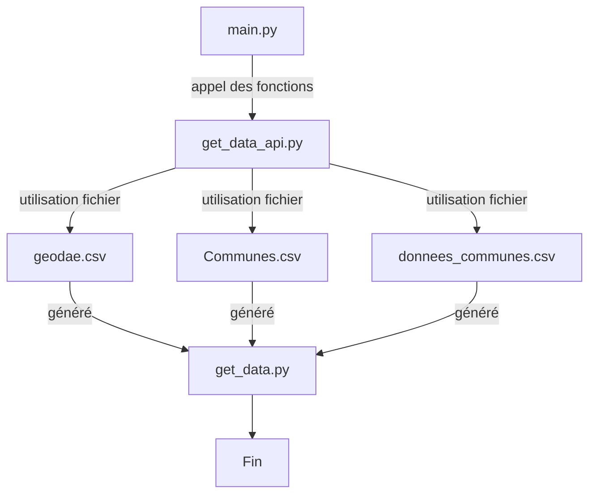

# Defibrillateur, produit par Thibault ANDRIAMASINORO & Antoine AVERLAND
Un projet permettant de recenser les défibrillateurs en France métropolitaine et de manière visible. Un histogramme ainsi qu'une carte de France permettent de démontrer d'une manière explicite les données fournies par [Géo'DAE](https://www.data.gouv.fr/fr/datasets/geodae-base-nationale-des-defibrillateurs/), tout en utilisant les données fournies par l'[INSEE](https://www.insee.fr/fr/accueil) vis-à-vis de la population française (2017 et 2019).  
L'utilisateur peut faire des affichages dynamiques via les filtres proposés par l'application.

## User Guide

### Déploiement
1. Cloner le dépôt sur votre machine locale.
```bash
git clone https://github.com/ThibaultAnd261/Defibrilateur.git
```
2. Accès au répertoire.
```bash
cd Defibrilateur
```

### Installation des packages, fichiers
1. Lancez la commande suivante pour l'installation des packages.
```bash
python -m pip install -r requirements.txt
```
2. Lancez la commande suivante pour le téléchargement des fichiers sur votre répertoire courant.
```bash
python get_data.py
```

### Lancement de l'application
1. Executez cette commande.
```bash
python main.py
```
2. Copiez-collez le lien suivant sur votre navigateur.
```bash
http://127.0.0.1:8050/
```

## Architecture / Developer Guide



Le fichier ```main.py``` regroupe principalement le rendu Dash (histogramme, carte) via les données fournies par la dataframe créée dans le fichier ```get_data_api.py```. Ce dernier est un fichier à part car il a une toute autre fonction. Son but est de manipuler directement la dataframe et ainsi retourner les données qui sont essentielles pour l'application Dash. Elle est retournée grâce aux fichiers générés par ```get_data.py```.
